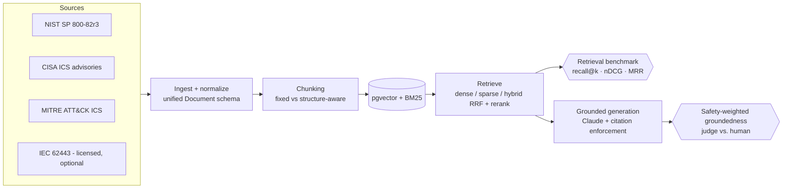

# Manifold

**A public retrieval benchmark and grounded-RAG pipeline for OT/ICS security documentation.**

Retrieval-augmented generation is only as good as its retrieval — yet in the
operational-technology / industrial-control-systems security domain there is *no public
benchmark that measures retrieval quality at all*. Every cybersecurity LLM benchmark
(CyberMetric, SECURE, CTIBench, …) tests knowledge with multiple-choice questions; none
publish query→relevant-passage judgments over a corpus, and none target OT/ICS. Manifold
builds that missing benchmark on copyright-clean public sources, and ships a working RAG
pipeline whose answer faithfulness is weighted by the safety-consequence of getting OT
guidance wrong.

> Status: **active build — truthseeking, not yet benchmarked.** The full pipeline
> (ingest → chunk → index → retrieve, plus grounded generation and the metrics harness) is
> built and unit-tested. **No benchmark numbers are published yet:** the public gold set has
> not been run, so there is no results table below the fold — only the harness that will
> produce one. The only gold set on disk today is a small *local* draft (10 queries, built on
> a local corpus that includes a licensed source, ~4 verified) — not the public artifact.
> Phase 6 (safety-weighted groundedness) is designed but not implemented. See
> [ROADMAP.md](ROADMAP.md) for exact per-phase status and known limitations.

## The corpus (public + copyright-clean)

| Source | Content | Docs |
|---|---|---|
| **NIST SP 800-82r3** | Guide to OT Security — structure-aware sections (public domain) | 273 |
| **CISA ICS advisories** | CSAF 2.0 machine-readable advisories, 2010–2026 (TLP:WHITE) | 3,829 |
| **MITRE ATT&CK for ICS** | Techniques, mitigations, software, groups, assets (STIX 2.1) | 212 |
| **IEC 62443** | *Optional, licensed, local-only — never committed* | 0 (public build) |

**4,314 normalized documents, ~4.8M tokens.** All sources normalize into one
[`Document`](src/manifold/schema.py) schema and land in `corpus/normalized/documents.jsonl`.

## What makes it different (and where each claim honestly stands)

1. **The first public OT/ICS *retrieval* gold set** — BEIR/TREC-compatible qrels with
   recall@k / precision@k / MRR / nDCG, including unanswerable / out-of-corpus queries.
   *Status: the generator + metrics harness are built and tested; the public gold set has
   not been drafted or human-verified yet, so no qrels or numbers are published.*
2. **Safety-weighted, human-calibrated groundedness** — wrong OT guidance is dangerous, so
   faithfulness is weighted by claim severity and calibrated against human labels. *Status:
   Phase 6, designed but not built. Today only a lightweight cited-fraction / abstention
   heuristic exists (see [`generate/answer.py`](src/manifold/generate/answer.py)); there is
   no claim decomposition, no severity taxonomy, and no judge↔human agreement number yet.
   This is the second contribution and it lives **in this repo** (see the note on `judge`
   below), not a separate project.*
3. **Honest configuration comparisons** — ≥2 chunking strategies × dense / BM25 / hybrid /
   rerank, with negative results reported, not hidden. *Status: the 12-config matrix runner
   exists; it produces no numbers until a verified gold set exists to score against.*

> **Truthseeking note.** This README describes the artifact honestly, including what is
> *not* done. Until a verified gold set and a committed `results.json` exist, treat every
> quantitative claim about which retrieval config "wins" as a hypothesis, not a result. The
> two side-by-side query anecdotes below are illustrations locked as regression tests, not
> aggregate evidence.

## Architecture



## Reproduce Phase 0

```bash
python -m venv .venv && . .venv/bin/activate
pip install -e .
# raw sources are pulled by scripts/pull_corpus.py (kept out of git); then:
python -m manifold.ingest.run
# -> corpus/normalized/documents.jsonl + stats.json
```

## Running the LLM stages (and what they cost)

Ingestion, chunking, embedding (BAAI/bge-small-en-v1.5), and reranking (ms-marco-MiniLM)
all run **locally and free** on Apple Silicon — no API key. Only three stages call an LLM,
each with a `MANIFOLD_*_MODEL` override:

| Stage | Env var | Default |
|---|---|---|
| Gold-set draft + relevance judging (`eval.generate`) | `MANIFOLD_JUDGE_MODEL` | `claude-sonnet-5` |
| Grounded generation (`generate.answer` / `generate.run`) | `MANIFOLD_GEN_MODEL` | `claude-opus-4-8` |

The default mix (Sonnet judge + Opus generation) is roughly **$10–12 for one clean pass**,
~$30–50 with iteration. To run the whole pipeline cheaply — a full pass fits inside a new
account's trial credit — point both at Haiku:

```bash
export ANTHROPIC_API_KEY=sk-ant-...
MANIFOLD_JUDGE_MODEL=claude-haiku-4-5 MANIFOLD_GEN_MODEL=claude-haiku-4-5 \
  python -m manifold.eval.generate --n-answerable 40 --n-unanswerable 12
```

The judge does hundreds of cheap 0/1/2 relevance calls that a human verifies anyway, so
Haiku is a fine choice there; reserve Opus/Sonnet for the visible generation and a final
calibration subset.

## Related work — and how Manifold stays in its lane

- **[Interlock](https://github.com/gregcarriger/Interlock)** — a red-team harness and
  action-boundary validator that stops an OT/ICS agent from being *talked into an unsafe
  action* (prompt injection, tool-call ALLOW/CONFIRM/DENY, provenance / operating-envelope /
  authorization checks on writes). Interlock guards what an agent **does**. Manifold is the
  complementary side: it measures whether what an agent **retrieves and says** is grounded in
  the corpus. There is no functional overlap — Interlock owns runtime action safety; Manifold
  owns retrieval quality and answer faithfulness. Manifold does **not** implement, and should
  not grow into, prompt-injection defense or a tool-call boundary.
- **`judge` (now merged here, not a separate repo).** The safety-weighted, human-calibrated
  groundedness metric was previously framed as a spin-off LLMOps eval project. It is now a
  first-class part of Manifold — Phase 6, living in this repository. Answer-faithfulness
  scoring is squarely within Manifold's "measure what the RAG system says" mandate, so there
  is no reason to split it out.

## Honest limitations (what a reviewer should know)

These are real, current constraints — documented rather than hidden, per the project's
truthseeking stance. Several are tracked as work items in [ROADMAP.md](ROADMAP.md).

- **No published results.** `corpus/goldset/` and `corpus/answers/` are empty; no
  `results.json` exists. The benchmark table this project is *about* has not been produced.
- **Gold-set pooling bias — addressed in code, not yet run at scale.** A single-retriever
  gold set lets a document no retriever surfaces stay unjudged (scored non-relevant) and
  structurally favors the retriever that built it. The fix is now built: depth-_k_ pooling
  across a diverse retriever fleet (BGE/E5/GTE/Nomic/Arctic + BM25, optional reranker/anchor)
  via `scripts/build_pool.py`, a staged `queries → pool → judge` drafter, and bias-robust
  reporting (bpref, judged@k pool coverage, leave-one-out) in `eval.run`. The ≥50-query public
  pool has **not been built or verified yet** (needs the model downloads + judge key), so there
  are still no published qrels. Methodology + commands: [POOLING.md](POOLING.md).
- **Doc-level qrels blunt the chunking comparison.** Collapsing chunk rankings to parent docs
  makes one gold set fair across strategies, but means the metric cannot reward a chunk that
  *pinpoints* the right passage over a blob that merely *contains* it — which is the whole
  point of comparing `fixed` vs `structure`.
- **Corpus imbalance.** ~89% of documents are CISA advisories. A "hybrid wins" result could
  be an artifact of advisory/identifier-lookup dominance rather than a general finding;
  report per-query-type breakdowns, not just corpus-wide means.
- **Token counts are a `chars/4` proxy** everywhere. All chunk-size statistics and the
  fixed-vs-structure size comparison rest on this estimate, not a real tokenizer.
- **Reproducibility depends on a frozen corpus.** Raw CISA/MITRE sources are pulled live and
  drift over time; "deterministic rebuild" holds only against a pinned snapshot/hash, which
  is not yet committed.

## License

MIT for the code. Corpus sources retain their own terms (NIST: public domain; CISA:
TLP:WHITE; MITRE ATT&CK: [terms](https://attack.mitre.org/resources/legal-and-branding/terms-of-use/)).
IEC 62443 is never redistributed here.
